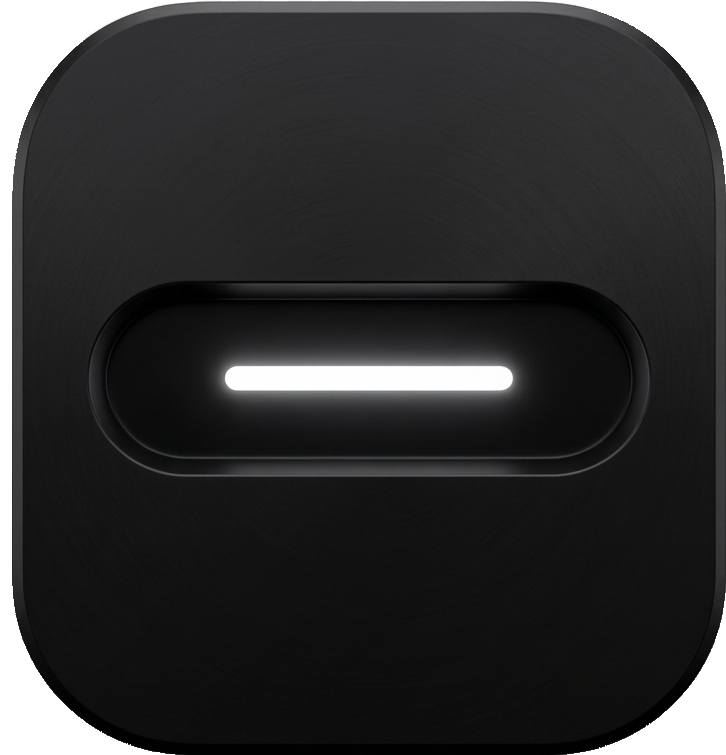

# Raven Notch

<p align="center">
  
</p>

<p align="center">
  <strong>A native Windows "Dynamic Island" — a floating, always-on-top notch that expands into a full control center.</strong>
</p>

<p align="center">
  <a href="https://github.com/RaunakxShrivastva/Raven-Island/actions"></a>
  <a href="https://github.com/RaunakxShrivastva/Raven-Island/releases"></a>
  <a href="LICENSE"></a>
  <a href="https://www.rust-lang.org/"></a>
  <a href="https://github.com/RaunakxShrivastva/Raven-Island/stargazers"></a>
  <a href="https://github.com/sponsors/RaunakxShrivastva"></a>
</p>

<p align="center">
  <a href="#features">Features</a> •
  <a href="#demo">Demo</a> •
  <a href="#installation">Installation</a> •
  <a href="#configuration">Configuration</a> •
  <a href="#architecture">Architecture</a> •
  <a href="#contributing">Contributing</a> •
  <a href="#license">License</a>
</p>

---

## 🎬 Demo

<p align="center">
  <video src="website/demo.mp4" controls width="720" alt="Raven Notch Demo"></video>
</p>

*Click to play — shows notch expand/collapse, media controls, calendar, widgets, and more.*

---

## ✨ Features

### 🎵 Media Control Center
- Play/pause, next/previous, seek ±10s
- Album art with adaptive accent extraction
- **Synced lyrics** via LRCLIB (LRC + plain text)
- Source switching (Spotify, YouTube Music, local players, etc.)
- Volume/brightness HUD overlays
- Pill waveform visualization

### 🕐 Time & Focus
- **World clocks**: New York, London, Tokyo, Delhi, Sydney, Paris, Dubai, Singapore (auto DST)
- Timer with custom durations, stopwatch
- **Focus sessions** (Pomodoro-style) with history & streak tracking
- Floating focus status bar (draggable, resizable)
- Focus completion overlay with glow animation

### 📅 Calendar
- Google Calendar OAuth (offline access, auto token refresh)
- ICS URL import (subscribe to any .ics feed)
- Mini-calendar picker with month/year navigation
- Event list with color-coded calendars
- Full calendar view when no media playing

### 📊 System Stats
- Real-time CPU / RAM / GPU (with 20-point sparkline history)
- Top 5 processes (CPU, RAM, path)
- Battery percentage, charging state, low-battery alerts
- Caffeine mode (prevent sleep / screen off)

### 📦 Drop Shelf & Sharing
- Drag files onto the notch → auto-expand shelf
- **Share providers**: LocalSend, Quick Share (Nearby), KDE Connect
- Persistent shelf (survives restarts), configurable max items
- Thumbnail previews for images/videos

### 📸 Capture
- Fullscreen screenshot, center region, custom region
- Saved to `Pictures\Raven Captures\` with timestamps
- Open last capture / reveal folder

### 🔔 Notifications
- Windows toast listener (last 5 notifications)
- App icons, grouped by app
- One-click open notification settings

### 🧩 Desktop Widgets (14 types)
| Widget | Description |
|--------|-------------|
| Clock | Multi-instance, configurable fields (CPU, RAM, battery, 12/24h) |
| Year Progress | Visual year progress ring |
| Day Progress | Day progress with sunrise/sunset |
| Month Progress | Month progress ring |
| Media | Now-playing with controls |
| Notes | Persistent sticky note |
| Todo | Checklist with accent colors, hide completed |
| Quotes | Rotating quotes (custom + built-in), auto-cycle |
| Picture | Display any image file |
| Video | Video/GIF playback (ffmpeg + MCI) |
| Battery Ring | Circular battery % with charging state |
| Calendar Focus | Focus timer + mini calendar |
| Apps Container | Pinned app shortcuts with drag-drop |
| Focus Score | Gamified focus tracking (goal hours, history, ring) |
| Streak | Habit streak calendar |
| System Stats | Mini CPU/RAM/GPU monitor |

### ⌨️ Hotkeys & Accessibility
- 23 configurable shortcuts (media, tabs, widgets, capture, system)
- **Magic chord**: `Ctrl+Alt+Shift+Win` + key → custom actions
- Hover-to-expand (configurable delay)
- Auto-hide on fullscreen apps
- Click-through mode for widgets

### 🎨 Customization
- Shape: pill / rounded / floating / custom
- Opacity, border radius, accent color
- Per-tab visibility, full-width bar mode
- Top-bar widgets (raven, media, apps, stats, clipboard, volume, wifi, battery, timer, calendar)
- Sounds: per-event .wav files or custom paths

### 🔐 Licensing
- Trial (14 days) → Premium unlock via license key
- Account sign-in via `ravennotch://auth` custom protocol
- Device fingerprinting, 7-day offline grace

---

## 📥 Installation

### Pre-built (Recommended)
1. Go to **Releases** → download `Raven-Notch.exe`
2. Run it — installs to `%LOCALAPPDATA%\Programs\Raven Notch`
3. Auto-adds to Start Menu, optional desktop shortcut

### From Source
```powershell
# Prerequisites
# - Windows 10/11 (x64)
# - Rust toolchain (MSVC): `rustup default stable-msvc`
# - Visual Studio Build Tools with Windows 10 SDK

git clone https://github.com/RaunakxShrivastva/Raven-Island.git
cd Raven-Island/raven-native

# Release build (optimized, stripped)
cargo build --release

# Run
.\target\release\Raven-Notch.exe
```

### Development Build
```powershell
cargo run
```

---

## ⚙️ Configuration

### Settings File
`%APPDATA%\RavenIsland\settings.json` — created on first run. Editable via the Settings window (right-click tray → Settings).

### Environment Variables

| Variable | Required | Description |
|----------|----------|-------------|
| `RAVEN_GOOGLE_CLIENT_SECRET` | For Calendar | Google OAuth client secret (Desktop app type). Create in [Google Cloud Console](https://console.cloud.google.com/apis/credentials). |

> **Note:** The Client ID is embedded in the app. Only the secret needs to be supplied at runtime.

### Google Calendar Setup
1. [Google Cloud Console](https://console.cloud.google.com/) → New Project → **APIs & Services → Credentials**
2. **Create Credentials → OAuth Client ID → Desktop App**
3. Copy **Client Secret** → set `RAVEN_GOOGLE_CLIENT_SECRET`
4. In Raven Settings → Calendar → **Connect Google Calendar**

---

## 🏗 Architecture

```
raven-native/
├── src/
│   ├── main.rs           # App entry: UI, widget lifecycle, timers, callbacks (14k LOC)
│   ├── window.rs         # Win32 overlay, hit-testing, hotkeys, tray, appbar, OLE drop (4k LOC)
│   ├── services.rs       # Media, notifications, capture, stats, calendar, shelf, caffeine (4k LOC)
│   ├── renderer.rs       # Hit-test + scene building, D2D→GDI fallback (500 LOC)
│   ├── graphics.rs       # Direct2D/DWrite backend (900 LOC)
│   ├── settings.rs       # Schema + load/save/validate (2k LOC)
│   ├── motion.rs         # Spring-morph notch physics (330 LOC)
│   ├── license.rs        # Premium/trial API client (500 LOC)
│   └── widgets.rs        # Volume/brightness, tab enums (1.2k LOC)
├── ui/                   # Slint UI (compiled by build.rs)
│   ├── pill.slint        # Main notch (5.8k lines)
│   ├── settings.slint    # Settings window (6.5k lines)
│   ├── panels/           # Tab panels (home, media, clock, drop, capture, notify, stats)
│   ├── types.slint       # Shared structs
│   └── assets/           # Icons, sounds, images
└── build.rs              # Slint compilation + Windows resource embedding
```

### Data Flow
```
Background threads (500ms–15min) → ServiceRegistry → RuntimeSnapshot (Mutex)
                                                              ↓
Slint timers (16ms/30ms/1s) → read snapshot → update Pill UI properties
                                                              ↓
Win32 WM_PAINT → NativeRenderer → Direct2D (or GDI fallback) → screen
```

### Key Technical Decisions
- **Render-on-demand**: `WM_PAINT` only, 16ms animation timer *only while animating*
- **Click-through via `WM_NCHITTEST`**: Returns `HTTRANSPARENT` outside interactive zones; left-button-held = `HTCLIENT` for OLE drag-drop
- **Appbar reservation**: Registers as top appbar (`ABM_NEW`) to reserve screen space
- **Dual window strategy**: Win32 native overlay + Slint OS window (subclassed for hit-testing)

---

## 🛠 Development

### Project Structure
```
Raven-Island/
├── raven-native/    # Main desktop app (this README)
├── raven-web/       # WASM build of Slint UI (website preview)
├── website/         # Marketing site + Netlify Functions (licensing API)
├── docs/            # Architecture docs (brain, history, structure)
├── scripts/         # Doc-agent watchers (Node)
└── design/          # Design assets
```

### Useful Commands
```powershell
cargo check                 # Fast type-check
cargo build                 # Debug build
cargo build --release       # Optimized release
cargo test                  # Run tests (monitor_math only)
cargo clippy                # Lints
cargo fmt                   # Format
```

### Adding a New Widget
1. Add struct to `src/widgets.rs` (if logic needed)
2. Create `.slint` in `ui/` + export in `ui/index.slint`
3. Add settings fields in `src/settings.rs` (`WidgetSettings`)
4. Add lifecycle in `src/main.rs` (`update_widget_lifecycles`)
5. Add sync in 1s timer (`src/main.rs` clock_timer)

---

## 🤝 Contributing

Contributions welcome! Please:

1. **Fork** → create feature branch (`git checkout -b feat/amazing-thing`)
2. **Follow style**: `cargo fmt` + `cargo clippy` clean
3. **Write tests** for new logic (monitor_math has examples)
4. **Update docs** if behavior changes
5. **Open PR** with clear description

### Good First Issues
- [ ] Linux/macOS stub (currently Windows-only)
- [ ] More share providers (AirDrop, Syncthing, etc.)
- [ ] Plugin system for custom widgets
- [ ] Unit tests for `services.rs` / `settings.rs`

### Code of Conduct
Be respectful. Harassment, discrimination, or abusive behavior will not be tolerated.

---

## 🗺 Roadmap

- [ ] **DirectComposition + DirectX 11** render path (no Slint, pure native)
- [ ] **Plugin API** (WASM or dynamic libs) for community widgets
- [ ] **Wayland/Linux** port via `smithay` or `winit` + `cosmic`
- [ ] **Mobile companion** (Android/iOS) for remote control
- [ ] **Cloud sync** for settings/widgets across devices
- [ ] **Marketplace** for community widgets/themes

---

## 📄 License

MIT License — see [LICENSE](LICENSE) for details.

Copyright (c) 2026 Raunak Shrivastava

---

## 🙏 Acknowledgements

- [Slint](https://slint.dev/) — declarative UI toolkit
- [windows-rs](https://github.com/microsoft/windows-rs) — Windows API bindings
- [sysinfo](https://github.com/GuillaumeGomez/sysinfo) — system stats
- [screenshots](https://github.com/GabrielBBlanc/screenshots-rs) — capture
- [LRCLIB](https://lrclib.net/) — lyrics database
- [Google Calendar API](https://developers.google.com/calendar) — calendar sync
- Icons from [Lucide](https://lucide.dev/), [Heroicons](https://heroicons.com/)
- Sounds from [Freesound](https://freesound.org/) contributors

---

## 📞 Support & Links

- **Issues**: [GitHub Issues](https://github.com/RaunakxShrivastva/Raven-Island/issues)
- **Discussions**: [GitHub Discussions](https://github.com/RaunakxShrivastva/Raven-Island/discussions)
- **Website**: [ravennotch.me](https://ravennotch.me)
- **License Portal**: [ravennotch.me/account](https://ravennotch.me/account)
- **Twitter**: [@ui_raunak](https://twitter.com/ui_raunak)

---

<p align="center">
  Made with ❤️ for Windows power users
</p>

---

<p align="center">
  
</p>

<p align="center">
  <strong>Topics:</strong> rust, windows, overlay, slint, dynamic-island, system-tray, media-control, widget-engine
</p>